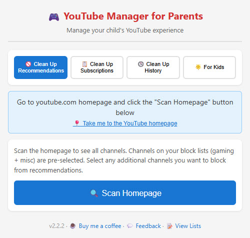
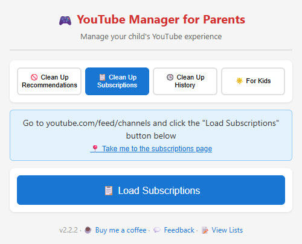
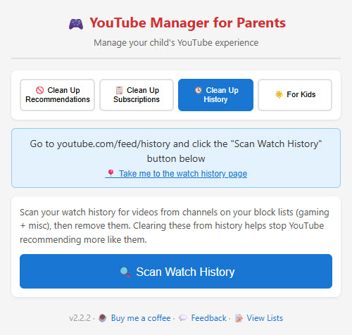
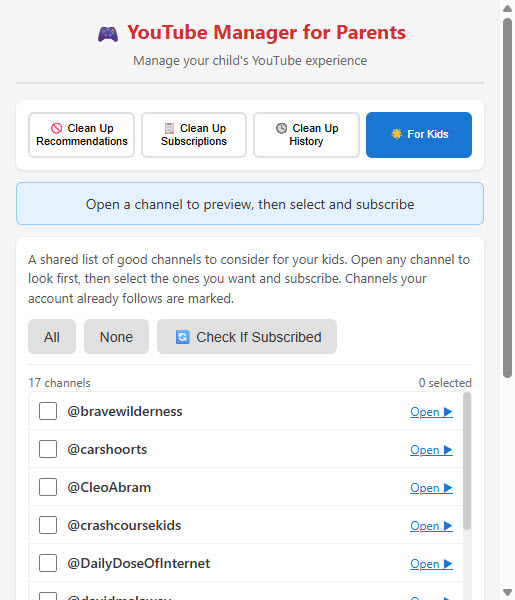

# YouTube Manager for Parents

A Chrome extension that helps parents clean up a child's YouTube account in bulk and point it toward better content. Prune subscriptions, recommendations, and watch history, and subscribe to a shared list of good channels.

## Screenshots

| Clean Up Recommendations | Clean Up Subscriptions |
|---|---|
|  |  |
| **Clean Up History** | **For Kids** |
|  |  |

## What it does

The popup has four tabs:

### 🚫 Clean Up Recommendations
- Scans the YouTube homepage (auto-scrolls to load more)
- Channels on your block lists are pre-selected; add others by keyword or by hand
- Applies YouTube's "Don't recommend channel" to the channels you pick
- Undo via myactivity.google.com → Other Google activity → YouTube "Not interested" feedback → Delete (note: this resets all such feedback, not individual ones)

### 📋 Clean Up Subscriptions
- Loads the full subscription list (auto-scrolls to capture every channel, not just visible ones)
- Select channels by block-list match, by keyword (name, handle, or description), or with "Select Bottom N" to prune the least-watched (sort the page by "Most relevant" first)
- One-click bulk unsubscribe

### 🕓 Clean Up History
- Scans watch history (auto-scroll, capped) for videos from channels on your block lists
- Removes selected videos from history, which helps retrain what YouTube recommends

### 🌟 For Kids
- A shared list of good channels to consider for your kids
- "Check If Subscribed" marks which ones the account already follows
- Open any channel to preview, then subscribe to the ones you select

### Throughout
- **Progress + per-item results** - failed items are listed with a reason
- **Survives popup close** - the unsubscribe, block, and history batches run in the page; closing the popup doesn't stop them (subscribing must keep the popup open, since it navigates between channel pages)
- **Stop button** to halt mid-run

## Channel lists

Detection is list-based and exact-match: a channel is flagged only when its name or @handle exactly equals an entry on a list (case-insensitive). No keyword or partial matching, to avoid false positives on destructive actions.

Three lists, all managed on GitHub under `lists/`:
- `gaming-channels.txt` - gaming channels (Gaming tag)
- `misc-channels.txt` - other blocked channels (Misc tag)
- `recommended-channels.txt` - good channels for the For Kids tab

The extension pulls the latest lists from GitHub each time the popup opens, with a local cache fallback if GitHub is unreachable. The footer "View Lists" panel shows counts, sync status, and links to each list on GitHub.

### Suggesting channels

You don't edit lists in the extension. Instead:
- **Block lists**: in Clean Up Subscriptions or Recommendations, select channels and click "Suggest Selected for Shared Block Lists"
- **Good channels**: in Clean Up Subscriptions, select channels and click "Suggest Selected as Good Channels for Kids"

Each opens a prefilled GitHub issue. The maintainer adds the `approved` label, and a GitHub Action appends the channels to the right list (deduped, sorted) and closes the issue. Every install picks up the change on its next refresh.

## Installation

### From source (developer mode)
1. Download or clone this repository
2. Open Chrome and go to `chrome://extensions/`
3. Enable **Developer mode** (top right)
4. Click **Load unpacked** and select the `youtube-manager-for-parents` folder

The kid's profile is typically a Family Link supervised account, which blocks unpacked/off-store installs. For that, publish/install via the Chrome Web Store (unlisted) instead.

## Usage notes

- Log into the child's YouTube account in the browser you run this from
- Each tab has a "Take me to..." link to the right YouTube page
- Run a small selection first to confirm everything works before a large batch

## Privacy

- No personal data is collected, and none is sent anywhere
- The only network request is fetching the public channel lists from GitHub
- All actions are performed by clicking YouTube's own controls in your tab, only when you click a button in the popup
- Uses your existing YouTube session; no separate login or API key

## Troubleshooting

- **Nothing found when scanning**: make sure you're on the right page (the tab tells you which) and logged into the correct account; refresh and try again
- **An action fails**: YouTube changes its page structure periodically; the per-item result log shows the reason. Open an issue with the detail
- **List changes not showing**: click Refresh in the View Lists panel; GitHub's CDN can lag a few minutes

## Disclaimer

- Unsubscribe and history removal are real actions; double-check selections first
- YouTube's UI changes over time and may break selectors until updated
- Use at your own risk

## License

MIT License.

## Contributing

Use the in-extension "Suggest" buttons to nominate channels, or open an issue / pull request. Suggestions for good kids channels and block-list additions are welcome.
